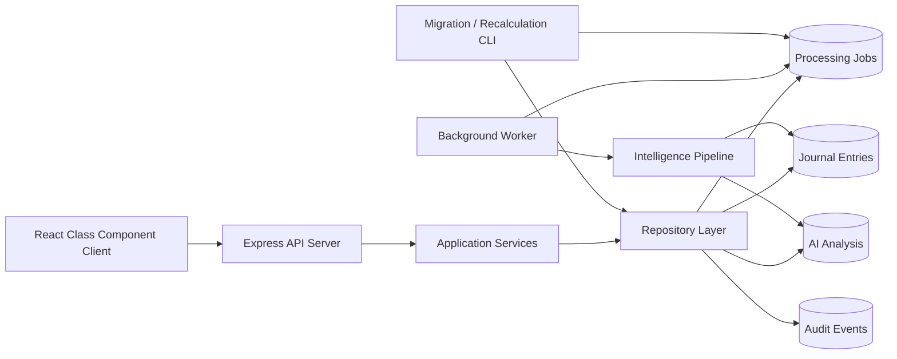
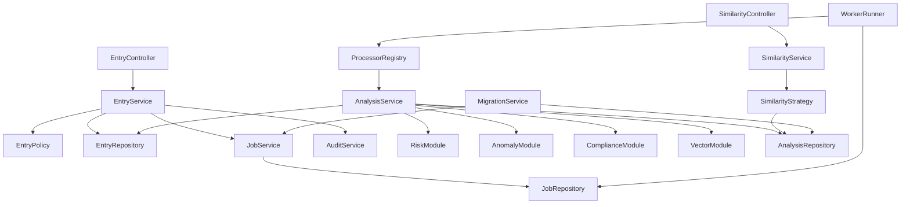

# Architecture Freeze: AI-Enriched Financial Audit Pipeline

## 1. High-Level System Architecture

The system should be implemented as a modular monolith with three independently running processes:

1. React client
2. Express API server
3. Background worker

MongoDB is the system of record and also provides the durable native work queue.



### Architectural Boundaries

- Journal entries are the authoritative accounting records.
- AI analysis is derived, replaceable data.
- Jobs represent durable asynchronous work.
- Audit events provide traceability.
- API processes never perform the simulated 400 ms intelligence workload.
- Workers never expose HTTP responsibilities.
- MongoDB mutations occur only through repository classes using targeted operators.
- The application remains one deployable codebase, avoiding premature microservices.

### Logical Database Collections

Without defining schemas, the system should maintain these logical stores:

- `journal_entries`
- `entry_analyses`
- `processing_jobs`
- `audit_events`
- `model_versions`
- `context_versions`

## 2. Complete Project Folder Structure

### Backend

```text
backend/
├── src/
│   ├── app/
│   │   ├── Application.js
│   │   ├── Server.js
│   │   └── Container.js
│   │
│   ├── config/
│   │   ├── EnvironmentConfig.js
│   │   ├── DatabaseConfig.js
│   │   ├── QueueConfig.js
│   │   ├── ProcessingConfig.js
│   │   └── LoggerConfig.js
│   │
│   ├── infrastructure/
│   │   ├── database/
│   │   │   ├── MongoConnection.js
│   │   │   └── TransactionManager.js
│   │   ├── queue/
│   │   │   ├── MongoJobQueue.js
│   │   │   ├── JobClaimer.js
│   │   │   ├── JobLeaseManager.js
│   │   │   └── JobRetryPolicy.js
│   │   ├── logging/
│   │   │   └── ApplicationLogger.js
│   │   └── monitoring/
│   │       ├── HealthMonitor.js
│   │       └── ProcessingMetrics.js
│   │
│   ├── modules/
│   │   ├── entries/
│   │   │   ├── controllers/
│   │   │   ├── routers/
│   │   │   ├── services/
│   │   │   ├── repositories/
│   │   │   ├── validators/
│   │   │   ├── policies/
│   │   │   ├── mappers/
│   │   │   └── errors/
│   │   │
│   │   ├── analysis/
│   │   │   ├── services/
│   │   │   ├── repositories/
│   │   │   ├── pipelines/
│   │   │   ├── risk/
│   │   │   ├── anomalies/
│   │   │   ├── vectors/
│   │   │   ├── compliance/
│   │   │   ├── versioning/
│   │   │   └── errors/
│   │   │
│   │   ├── similarity/
│   │   │   ├── controllers/
│   │   │   ├── routers/
│   │   │   ├── services/
│   │   │   ├── repositories/
│   │   │   ├── strategies/
│   │   │   └── validators/
│   │   │
│   │   ├── jobs/
│   │   │   ├── services/
│   │   │   ├── repositories/
│   │   │   ├── policies/
│   │   │   └── errors/
│   │   │
│   │   ├── audit/
│   │   │   ├── services/
│   │   │   └── repositories/
│   │   │
│   │   └── administration/
│   │       ├── services/
│   │       ├── repositories/
│   │       └── validators/
│   │
│   ├── workers/
│   │   ├── WorkerApplication.js
│   │   ├── WorkerRunner.js
│   │   ├── JobProcessorRegistry.js
│   │   ├── processors/
│   │   │   ├── FullAnalysisProcessor.js
│   │   │   ├── PartialRiskProcessor.js
│   │   │   └── ModelMigrationProcessor.js
│   │   └── lifecycle/
│   │       ├── WorkerShutdown.js
│   │       └── LeaseRecovery.js
│   │
│   ├── scripts/
│   │   ├── seed/
│   │   ├── model-migration/
│   │   ├── partial-recalculation/
│   │   └── maintenance/
│   │
│   ├── shared/
│   │   ├── constants/
│   │   ├── errors/
│   │   ├── validation/
│   │   ├── pagination/
│   │   ├── serialization/
│   │   └── utilities/
│   │
│   └── bootstrap/
│       ├── ApiBootstrap.js
│       ├── WorkerBootstrap.js
│       └── ScriptBootstrap.js
│
├── test/
│   ├── unit/
│   ├── integration/
│   ├── workers/
│   ├── migrations/
│   ├── fixtures/
│   └── helpers/
│
├── logs/
├── .env.example
├── package.json
└── README.md
```

### Frontend

```text
frontend/
├── public/
│   ├── index.html
│   └── assets/
│
├── src/
│   ├── app/
│   │   ├── App.js
│   │   ├── AppRouter.js
│   │   └── AppErrorBoundary.js
│   │
│   ├── config/
│   │   └── ClientConfig.js
│   │
│   ├── api/
│   │   ├── ApiClient.js
│   │   ├── EntryApi.js
│   │   └── SimilarityApi.js
│   │
│   ├── pages/
│   │   ├── dashboard/
│   │   └── entry-details/
│   │
│   ├── components/
│   │   ├── entries/
│   │   ├── risk/
│   │   ├── anomalies/
│   │   ├── vectors/
│   │   ├── similarity/
│   │   ├── status/
│   │   ├── feedback/
│   │   └── layout/
│   │
│   ├── services/
│   │   ├── EntryService.js
│   │   ├── SimilarityService.js
│   │   └── PollingService.js
│   │
│   ├── state/
│   │   ├── DashboardState.js
│   │   └── EntryViewState.js
│   │
│   ├── mappers/
│   ├── validators/
│   ├── constants/
│   ├── errors/
│   ├── styles/
│   └── utilities/
│
├── test/
│   ├── unit/
│   ├── integration/
│   ├── fixtures/
│   └── helpers/
│
├── .env.example
├── package.json
└── README.md
```

## 3. Folder Responsibilities

### Backend

| Folder | Responsibility |
|---|---|
| `app` | Constructs the Express application and dependency container. |
| `config` | Validates and exposes typed runtime configuration. |
| `infrastructure/database` | MongoDB connection management and transaction boundaries. |
| `infrastructure/queue` | Durable MongoDB queue claiming, leases, retries and recovery. |
| `infrastructure/logging` | Structured application and worker logging. |
| `infrastructure/monitoring` | Health, queue-depth and processing metrics. |
| `modules/entries` | Journal-entry commands, queries, delta classification and persistence. |
| `modules/analysis` | Risk, anomaly, vector, compliance and versioning logic. |
| `modules/similarity` | Strategy-based semantic, financial and entity similarity searches. |
| `modules/jobs` | Job creation, deduplication, status and cancellation rules. |
| `modules/audit` | Immutable operational audit history. |
| `modules/administration` | Model migrations and regulatory recalculation orchestration. |
| `workers` | Polls jobs and executes registered background processors. |
| `scripts` | Class-based CLI entry points for seeding, migration and maintenance. |
| `shared` | Cross-module primitives with no domain ownership. |
| `bootstrap` | Starts API, worker or CLI processes independently. |
| `test` | Unit, integration, worker and migration verification. |
| `logs` | Local development logs only; production logs go to standard output. |

### Frontend

| Folder | Responsibility |
|---|---|
| `app` | Root class component, routing and top-level error boundary. |
| `config` | Client runtime configuration. |
| `api` | HTTP transport and endpoint-specific API classes. |
| `pages` | Stateful screen-level React class components. |
| `components` | Reusable presentation and interaction class components. |
| `services` | Coordinates API calls, polling and client workflows. |
| `state` | Initial-state factories and class-friendly state transition definitions. |
| `mappers` | Converts API responses into view models. |
| `validators` | Client-side input validation. |
| `constants` | Stable UI enums and display mappings. |
| `errors` | Client error classification. |
| `styles` | Bootstrap customization and application styling. |
| `utilities` | Small stateless formatting helpers. |
| `test` | Component, service and workflow tests. |

Helpers may remain functions where appropriate, but all primary React structures must be class components and all backend architectural layers must use ES6 classes.

## 4. Recommended Architecture Pattern

Use:

**Router → Controller → Service → Repository → Database**

For asynchronous operations:

**Service → Job Repository → Queue Store → Worker → Analysis Service → Repository → Database**

The requested `Controller → Service → Repository → Worker → Database` sequence should not be interpreted as one synchronous chain. A repository must not call a worker. Instead:

- Controllers translate HTTP input and output.
- Services own use-case orchestration.
- Repositories own database access.
- Services enqueue durable jobs through a job abstraction.
- Workers consume jobs outside the request lifecycle.
- Workers invoke the same analysis services and repositories used by administrative workflows.

This preserves testability and prevents transport, persistence and processing concerns from becoming coupled.

## 5. Background Worker Integration

### Request Lifecycle

1. Controller validates transport-level input.
2. Entry service classifies the operation.
3. Repository performs the targeted journal-entry mutation.
4. If analysis is required, the service creates a durable job.
5. The API returns without waiting for the 400 ms analysis.
6. A worker atomically claims the job.
7. The worker loads the current entry revision.
8. The intelligence pipeline performs analysis.
9. The analysis repository atomically stores the result.
10. The worker marks the job completed.

### Required Job Behavior

- Atomic job claiming
- Lease expiration for crashed workers
- Bounded retries with backoff
- Permanent failure state
- Job deduplication
- Attempt history
- Processing timestamps
- Graceful shutdown
- Recovery of abandoned jobs
- Idempotent processors

### Concurrency Protection

Every source-data mutation advances an entry revision.

Each job records the revision it was created for. Before committing analysis, the worker verifies that the entry is still at that revision. If it is stale, its result is discarded and the latest pending job remains authoritative.

This prevents an older worker from overwriting analysis produced for newer financial data.

## 6. Isolating AI Analysis from Journal Entries

Store core journal entries and derived analysis in separate collections.

### Journal-Entry Boundary

Contains:

- Assessment-defined baseline accounting fields
- Auditor-controlled workflow metadata
- Source revision and processing state
- No vector arrays or detailed AI output

### Analysis Boundary

Contains:

- Risk result
- Severity
- Anomaly signals
- Compliance result
- Semantic vector
- Financial vector
- Entity vector
- Model versions
- Context/rules version
- Source revision used for calculation
- Processing status and timestamps

### Immutability Interpretation

“Immutable journal entry” means AI processing must never mutate or replace financial source fields. Authorized auditor updates to the four assessment-defined core fields are controlled revisions of the authoritative record, not AI mutations.

Benefits:

- AI failures cannot corrupt accounting data.
- Large vectors do not inflate routine ledger reads.
- Analysis can be replaced or migrated independently.
- Partial recalculation can avoid touching vectors.
- Model-version migrations do not rewrite journal entries.
- Similarity queries can operate on an analysis-focused collection.
- Retention and indexing policies can differ.

## 7. Processing Lifecycles

### 7.1 Create Entry

1. Validate the baseline entry.
2. Persist the authoritative entry.
3. Set its analysis state to pending.
4. Record an audit event.
5. Create a full-analysis job in the same transactional boundary where supported.
6. Return the created entry with pending status.
7. Worker claims the job.
8. Worker reloads the current entry and revision.
9. Simulate the 400 ms model execution.
10. Compute risk, anomalies, compliance and all three vector spaces.
11. Store the analysis separately.
12. Mark the entry analysis state ready.
13. Complete the job.

If atomic multi-document transactions are unavailable, use a recoverable outbox-style reconciliation process that detects pending entries without jobs.

### 7.2 Update Entry

The service first calculates the changed-field set.

#### Core Analysis Field Changed

Core fields:

- `amount`
- `description`
- `glNumber`
- `postingDate`

Lifecycle:

1. Validate allowed changes.
2. Atomically update only changed fields.
3. Increment the source revision.
4. Mark existing analysis stale.
5. Record the audit event.
6. Deduplicate obsolete pending jobs.
7. Enqueue full analysis for the new revision.
8. Return immediately with stale/pending status.
9. Worker performs complete recomputation.
10. Worker commits only if the revision is still current.

#### Other Financial Field Changed

Changes outside the explicitly listed four should be governed by a centralized field-impact policy. Each field must be classified as:

- Full-analysis impact
- Partial-analysis impact
- Metadata-only impact
- Forbidden update

This avoids scattering field-name checks across controllers.

### 7.3 Batch Migration

Used when model versions change.

1. Migration command acquires a migration lock.
2. Read the active target model versions.
3. Query only stale analysis records.
4. Page by stable `_id` cursor, never offset pagination.
5. Use a bounded batch size.
6. Enqueue idempotent migration jobs for each page.
7. Persist the last successful cursor as a checkpoint.
8. Apply backpressure when queue depth exceeds a configured threshold.
9. Workers recompute the required stale analysis blocks.
10. Migration reports scanned, queued, completed, failed and skipped totals.
11. Rerunning the command resumes safely.

The migration process must not load the full historical dataset into memory.

### 7.4 Partial Recalculation

Used when compliance rules or risk thresholds change but vectors remain valid.

1. Read the new context version.
2. Select records with an older risk/context version.
3. Traverse records using `_id` cursor pagination.
4. Load the source entry and only the analysis inputs required.
5. Recompute risk, severity and compliance.
6. Update only those paths using targeted operators.
7. Preserve vector fields and vector model versions.
8. Record the new context version.
9. Checkpoint progress and report failures.

A dedicated partial processor prevents accidental invocation of vector generation.

### 7.5 Metadata Update

Metadata includes auditor comments and workflow status.

1. Validate metadata permissions and allowed transitions.
2. Atomically update only metadata paths.
3. Record the audit event.
4. Do not increment the financial source revision.
5. Do not mark analysis stale.
6. Do not create a job.
7. Return the updated record immediately.

## 8. Native Queue vs BullMQ

### Recommendation: MongoDB-Native Durable Queue

For this assessment, use a MongoDB-backed queue rather than BullMQ.

### Justification

- MongoDB is already required.
- BullMQ introduces Redis, additional deployment configuration and another failure domain.
- The workload is limited to a mocked 400 ms pipeline, migration jobs and partial recalculation.
- MongoDB supports atomic job claiming through targeted conditional updates.
- Queue state is directly inspectable during the demonstration.
- It demonstrates lease management, retry handling, idempotency and race-condition awareness.
- It keeps local execution to the required server, worker, client and MongoDB processes.

### Required Limitations

Do not implement the queue as an in-memory array. Jobs must survive API or worker restarts.

### Upgrade Threshold

BullMQ becomes preferable when the system requires:

- Very high job throughput
- Low-latency delivery
- Sophisticated delayed jobs
- Priorities and rate limiting
- Large numbers of concurrent workers
- Complex workflow dependencies
- Redis already exists in the platform

The queue interface must hide its MongoDB implementation so BullMQ can replace it later without changing controllers or analysis services.

## 9. Major Project Modules

1. Application bootstrap
2. Configuration management
3. Dependency container
4. MongoDB connection management
5. Journal-entry management
6. Update impact classification
7. Analysis orchestration
8. Risk scoring
9. Severity classification
10. Anomaly detection
11. Compliance evaluation
12. Semantic vector generation
13. Financial vector generation
14. Entity vector generation
15. Similarity search
16. Model version management
17. Context/rules version management
18. Job queue management
19. Worker execution
20. Retry and lease recovery
21. Audit history
22. Batch model migration
23. Partial recalculation
24. Database seeding
25. Health and readiness monitoring
26. Structured logging and processing metrics
27. Dashboard UI
28. Entry diagnostics UI
29. Similarity-search UI
30. Client polling and processing-status handling

## 10. Module Dependencies



### Dependency Rules

- Controllers depend on services, never repositories.
- Services may depend on repositories and domain policies.
- Repositories depend on MongoDB infrastructure.
- Workers depend on job and analysis services.
- Analysis modules must not depend on HTTP classes.
- Entry repositories must not contain risk or anomaly logic.
- Similarity strategies must not modify analysis.
- Frontend components depend on frontend services, not raw HTTP transport.
- Shared utilities must not import domain modules.
- Circular module dependencies are prohibited.

## 11. Coding Standards and Naming Conventions

### General

- ES modules consistently throughout the project.
- One primary class per file.
- Class names use `PascalCase`.
- Methods, variables and files containing configuration values use `camelCase`.
- Constants use `UPPER_SNAKE_CASE`.
- Boolean names begin with `is`, `has`, `can` or `should`.
- Avoid abbreviations except established terms such as `AI`, `API`, `GL` and `ID`.
- No database access outside repositories.
- No business decisions inside controllers or routers.
- No direct environment-variable access outside configuration classes.
- No unstructured console logging.

### Backend Suffixes

- `Controller`
- `Router`
- `Service`
- `Repository`
- `Policy`
- `Validator`
- `Mapper`
- `Processor`
- `Strategy`
- `Config`
- `Error`

### Frontend Conventions

- All pages and structural components extend `React.Component`.
- State is initialized explicitly.
- Bind event handlers consistently.
- Use lifecycle methods for loading, polling and cleanup.
- Cancel timers and requests during unmounting.
- Do not duplicate server-derived analysis logic in the client.
- Separate container-style page classes from reusable display classes.
- Loading, empty, stale, failed and ready states must be explicit.

### Quality Controls

- ESLint and Prettier
- Strict input validation
- Central error classification
- Structured JSON logs
- Correlation IDs across API requests and jobs
- Unit tests for policies and intelligence modules
- Integration tests for targeted updates
- Worker retry and stale-result tests
- Migration resume and memory-bound tests
- No floating-point equality for financial validation; use a defined precision/tolerance policy

## 12. Scalability Bottlenecks and Mitigations

| Bottleneck | Architectural Mitigation |
|---|---|
| 400 ms analysis blocks API requests | Analysis runs only in workers. |
| Large vectors inflate ledger reads | Vectors live in a separate analysis collection. |
| Worker crashes leave jobs stuck | Lease expiration and abandoned-job recovery. |
| Repeated rapid updates create stale jobs | Revision checks, deduplication and idempotent processors. |
| Old workers overwrite newer results | Compare source revision before committing. |
| Batch migration exhausts memory | `_id` cursor pagination and bounded batches. |
| Migration overwhelms workers | Queue-depth backpressure and configurable concurrency. |
| Regulatory updates rewrite vectors | Dedicated partial processor and targeted operators. |
| Metadata edits trigger unnecessary AI work | Central field-impact classification. |
| Similarity search performs full collection scans | Separate vector-oriented indexes/search strategy; limit to one selected vector space and top five results. |
| Growing job history slows polling | Status/time indexes and retention or archival policy. |
| Multiple API instances create duplicate jobs | Database-enforced logical deduplication and atomic job insertion. |
| Queue polling creates database pressure | Indexed claim query, controlled poll interval and exponential idle backoff. |
| Native queue reaches throughput limits | Queue abstraction permits later BullMQ replacement. |
| Analysis collection grows indefinitely | Version-retention and archival policy. |
| Client overloads API while polling | Bounded polling intervals, stop conditions and page-level coordination. |
| Audit history grows rapidly | Append-only storage with pagination and retention planning. |

## Implementation Roadmap

1. Freeze architectural decisions and field-impact classifications.
2. Define logical data boundaries and versioning strategy.
3. Establish backend and frontend project skeletons.
4. Implement configuration, logging and dependency construction.
5. Implement MongoDB connection and repository foundations.
6. Implement journal-entry persistence and targeted mutation behavior.
7. Implement audit-event recording.
8. Implement the native MongoDB durable queue.
9. Implement worker claiming, leasing, retries and graceful shutdown.
10. Implement risk, anomaly, compliance and vector intelligence modules.
11. Implement full-analysis orchestration with revision protection.
12. Implement create-entry asynchronous processing.
13. Implement update delta classification and recomputation behavior.
14. Implement metadata-only atomic updates.
15. Implement strategy-based similarity search.
16. Implement model-version migration with cursor pagination and checkpoints.
17. Implement partial risk/compliance recalculation.
18. Implement seed and maintenance commands.
19. Build the React class-component dashboard.
20. Build diagnostics, anomaly, vector and similarity views.
21. Add client polling, loading, stale and failure states.
22. Add unit, integration, worker and migration tests.
23. Test concurrent updates, duplicate jobs and worker crashes.
24. Add health checks, metrics and queue monitoring.
25. Finalize environment documentation and execution commands.
26. Perform performance and memory verification.
27. Capture demonstration screenshots or video.
28. Complete production-readiness review and freeze the release.
