# Project Flow - AI-Enriched Financial Audit Pipeline

This document explains the complete application flow visually and textually. Use this when you want to understand how a user action moves through the React frontend, Express API, MongoDB repositories, MongoDB queue, worker process, and deterministic AI analysis engine.

## 1. Full System Overview

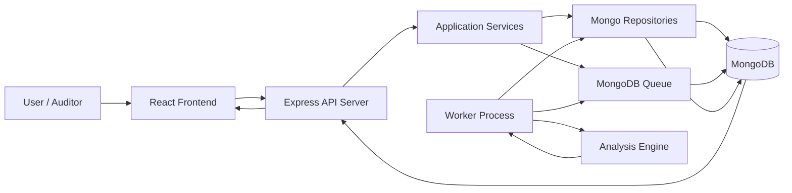

Core idea:

- The API responds quickly.
- Long-running analysis is never executed inside the HTTP request.
- The API writes a job into MongoDB.
- The worker process picks that job and runs analysis asynchronously.
- The frontend reads the latest entry, analysis, and processing state.

## 2. Runtime Processes

The project runs as three local processes.

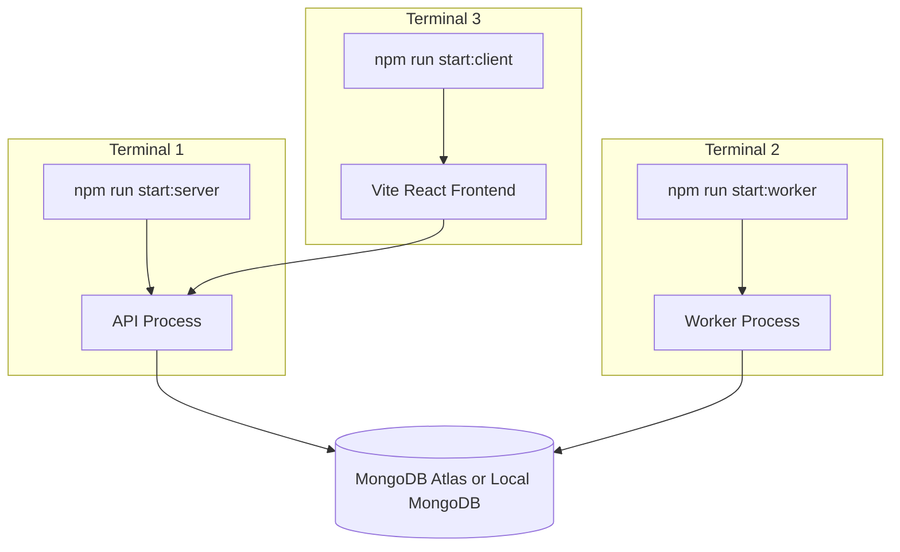

No Redis is required. No BullMQ is required. No Docker is required for local execution.

## 3. Frontend Flow

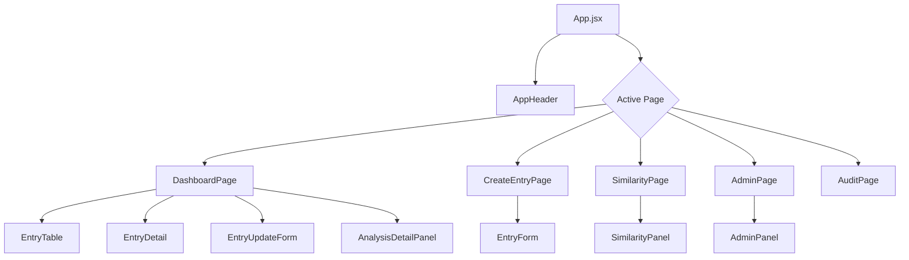

Frontend rules:

- React class components only.
- No hooks.
- API calls go through service classes.
- UI components do not know fetch details.

## 4. Frontend Service Layer

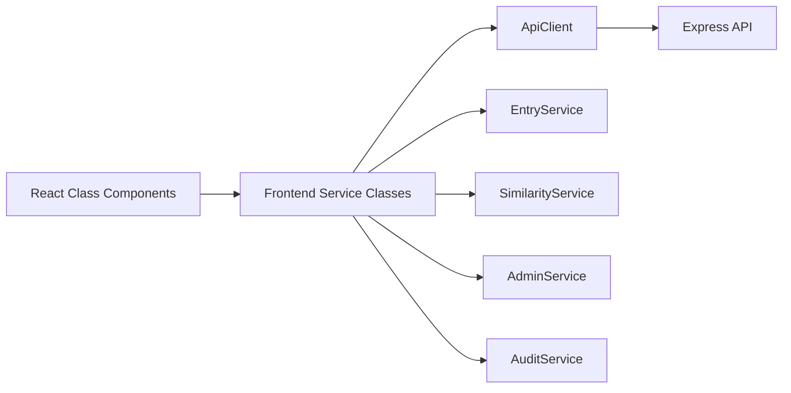

Why this matters:

- Components remain focused on rendering and state.
- API paths and HTTP behavior stay centralized.
- Future auth headers or request tracing can be added in ApiClient only.

## 5. Backend Layering

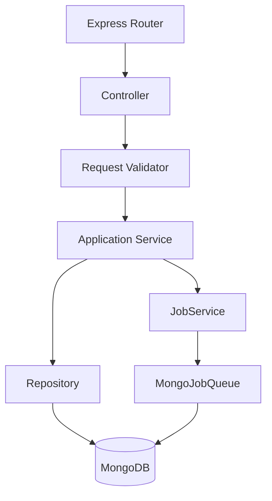

Layer responsibilities:

| Layer        | Responsibility                                        |
| ------------ | ----------------------------------------------------- |
| Controller   | Validate transport request and return response        |
| Service      | Business orchestration                                |
| Repository   | MongoDB persistence only                              |
| Queue        | Durable job state                                     |
| Worker       | Background execution                                  |
| Intelligence | Deterministic risk/anomaly/compliance/vector analysis |

## 6. Create Entry Flow

User creates a journal entry from the frontend.

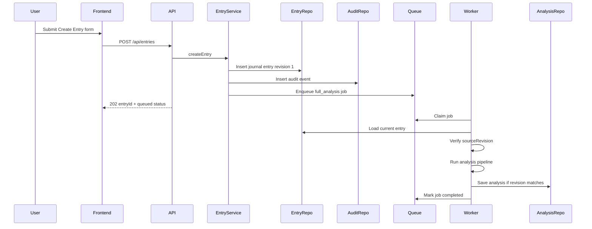

Important behavior:

- API returns immediately after job creation.
- Worker handles analysis later.
- The dashboard shows processing status while the job runs.

## 7. Update Entry Flow

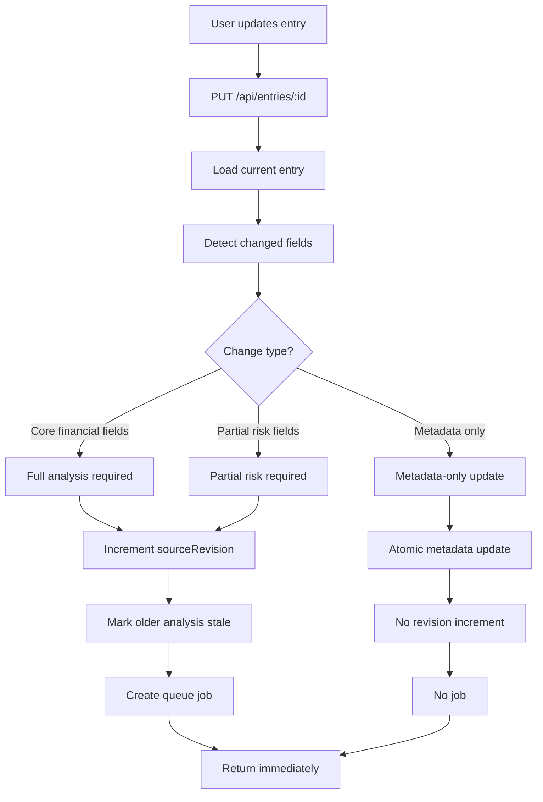

Decision summary:

| Update Type           | Revision Increment | Queue Job | Reason                     |
| --------------------- | -----------------: | --------: | -------------------------- |
| Core financial change |                Yes |       Yes | Analysis can change        |
| Partial risk change   |                Yes |       Yes | Risk/compliance can change |
| Metadata only         |                 No |        No | Analysis does not change   |
| No change             |                 No |        No | Nothing to process         |

## 8. Queue and Worker Flow

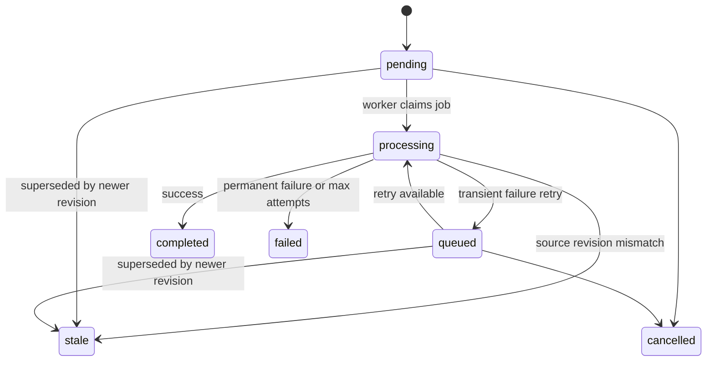

Queue collection:

```text
processing_jobs
```

Worker guarantees:

- Atomic job claim.
- Lease ownership.
- Lease renewal during work.
- Retry with backoff.
- Stale protection when newer revisions exist.
- No old job can overwrite newer analysis.

## 9. Analysis Pipeline

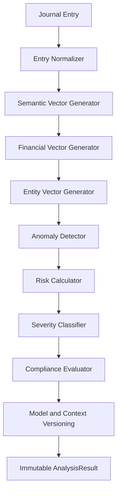

Analysis output:

- riskScore
- severity
- triggeredRules
- anomalies
- compliance result
- semantic vector
- financial vector
- entity vector
- model versions
- context version

The assessment version does not call OpenAI and does not use ML embeddings. Vectors are deterministic mock vectors derived from source data.

## 10. Revision Protection

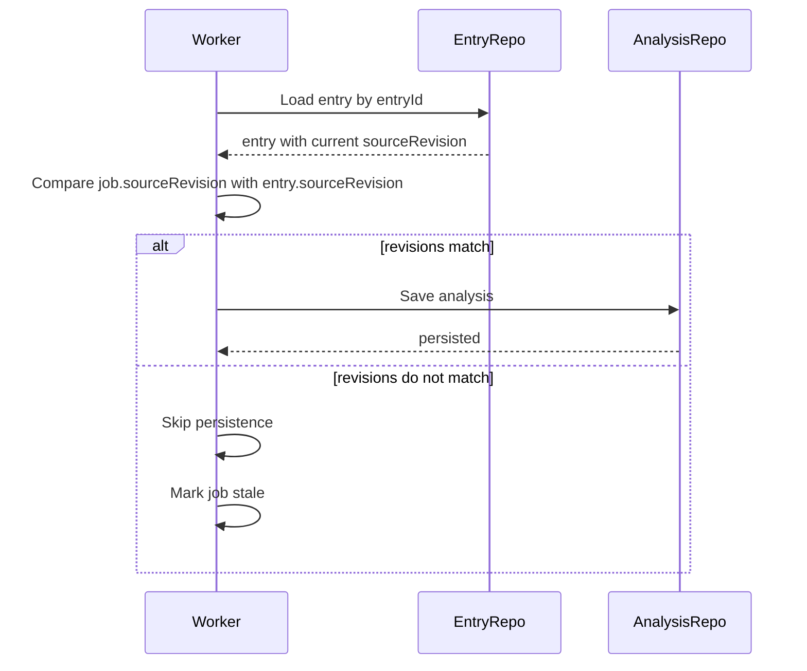

Why this exists:

If a user updates an entry while an older job is still processing, the older job must not overwrite the newer result.

## 11. Database Collections

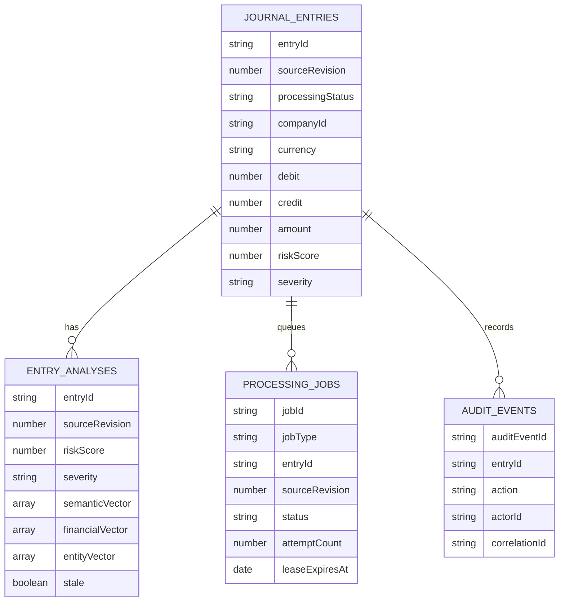

This is a conceptual map of the MongoDB collections used by the application.

## 12. Dashboard Read Flow

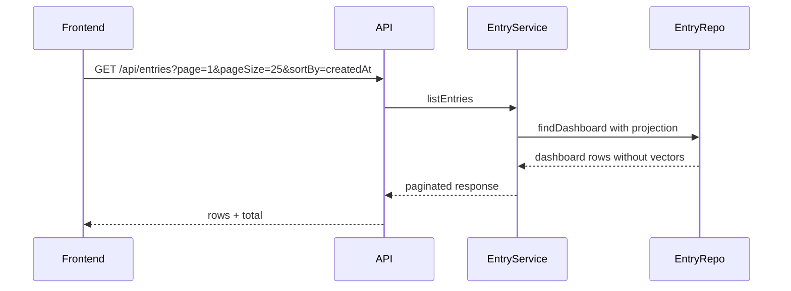

Dashboard intentionally excludes vectors because vectors are large and not needed in list views.

## 13. Entry Detail Read Flow

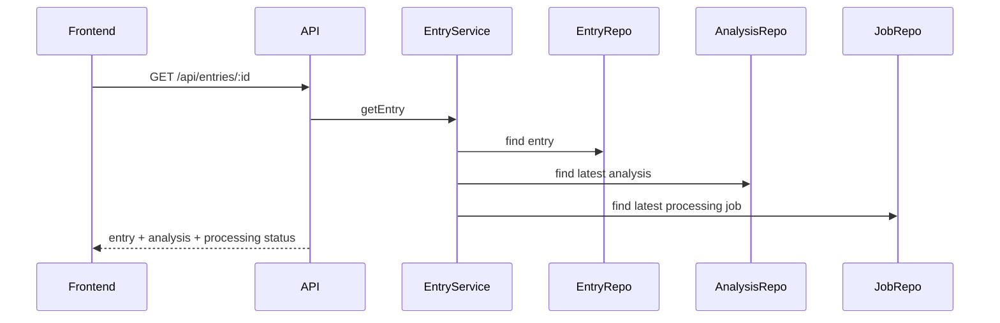

The frontend uses this response to render:

- journal entry summary
- update form
- risk summary
- anomalies
- compliance
- vector summary
- processing state

## 14. Similarity Search Flow

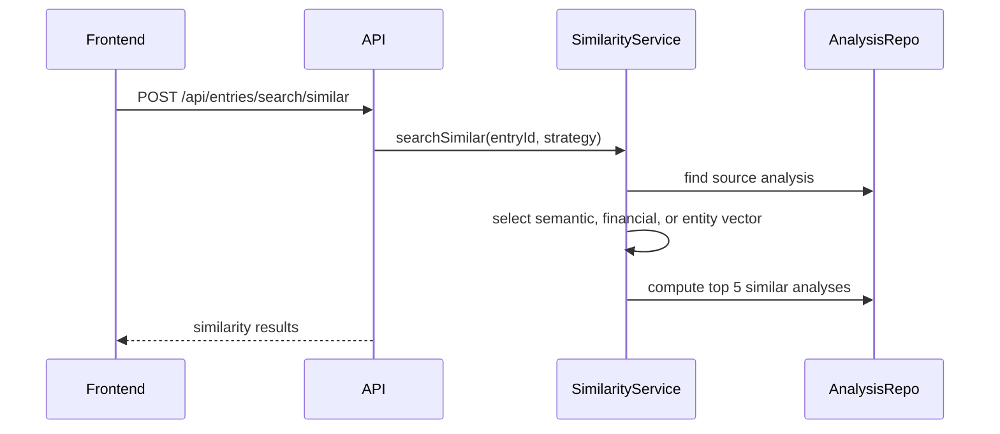

Supported strategies:

- semantic
- financial
- entity

## 15. Admin and Migration Flow

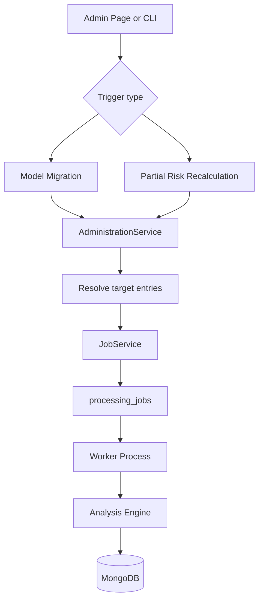

Migration does not run synchronously. It only queues jobs. The worker executes them.

CLI trigger:

```bash
npm run migrate:models
```

API trigger:

```http
POST /api/admin/model-migrations
```

## 16. Seed Flow

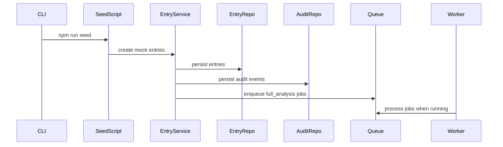

Seed command:

```bash
npm run seed
```

## 17. Local Execution Timeline

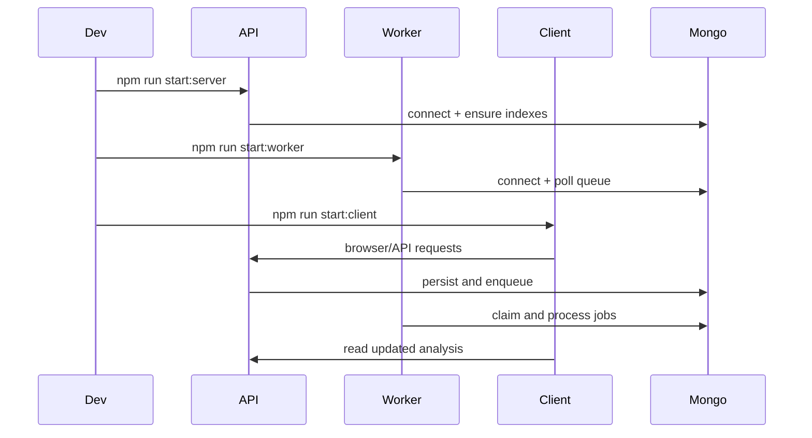

## 18. Error Handling Flow

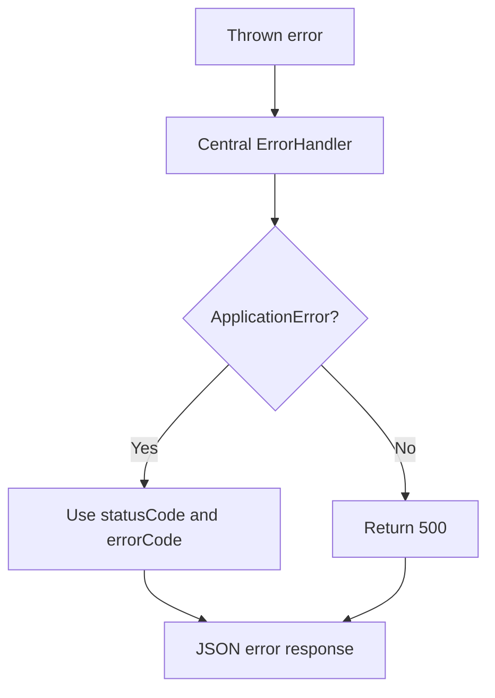

Error response includes:

- requestId
- timestamp
- errorCode
- message
- details when safe

## 19. Complete User Journey

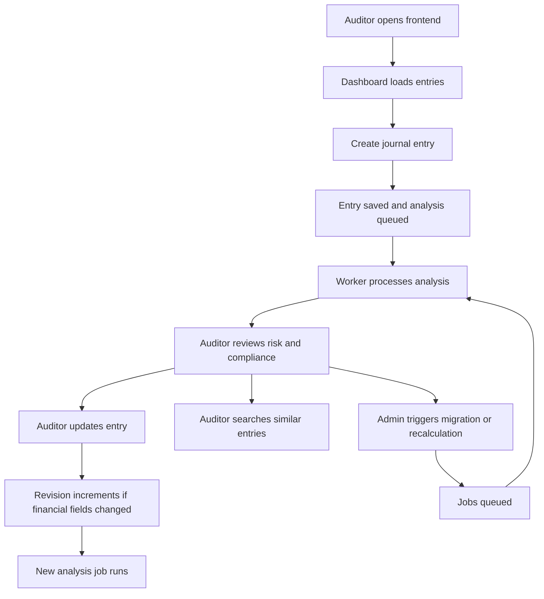

## 20. Final Mental Model

Think of the system as four cooperating parts:

```text
Frontend = user workflow and visualization
API = validation and orchestration
MongoDB = durable state and queue storage
Worker = asynchronous analysis execution
```

The key production safety mechanism is sourceRevision. It ensures derived analysis never overwrites a newer version of a journal entry.
